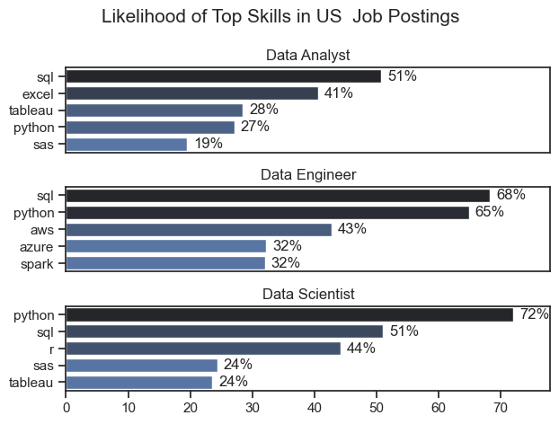
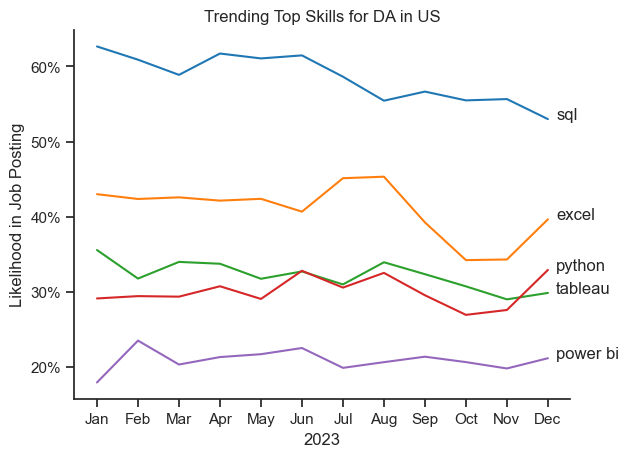
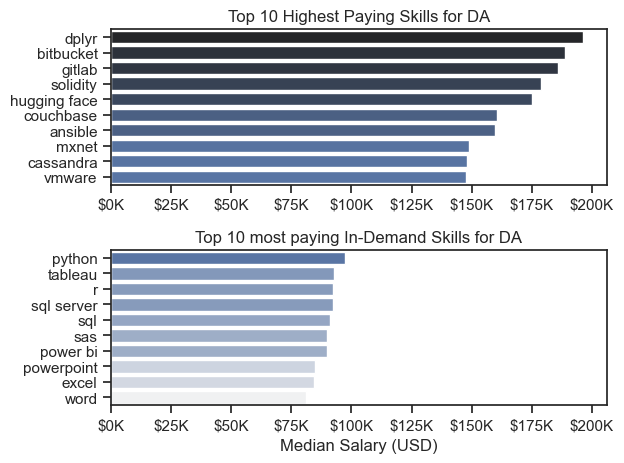
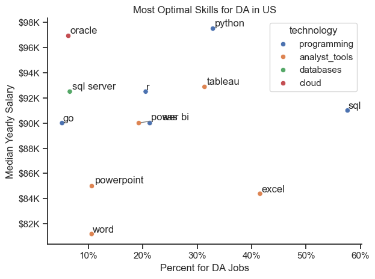

# Overview
This project analyzes the most optimal skills for Data Analysts in the US by evaluating their demand in the job market and median yearly salary. The insights are derived from industry trends and salary distributions to help professionals identify valuable skills for career growth.

# Tools I Used
For my deep dive into this project, I utilized the power of several key tools:

- **Python**: Main tool for my analysis, allowing me to analyze the data and find critical insights.  
  - **Pandas Library** – Used to analyze the data  
  - **Matplotlib Library** – Used to visualize data  
  - **Seaborn Library** – Used to create more advanced visuals  
- **Jupyter Notebook**: Used to run my Python scripts and perform interactive data analysis.  
- **Visual Studio Code**: Code editor for writing, running, and debugging scripts.  
- **Git & GitHub**: Used for version control, collaboration, and project management.  


# The Analysis

## 1. What are the most demanded skills for the top 3 most popular data roles?

To find the most demanded skills for the top 3 most popular data roles. I filtered out those positions by the most popular, and got the top 5 skills for these 3 roles. This query highlights the most popular job titles and their top skills, showing which skills we should pay attention to depending on the role we're targeting.

View my notebook with detailed steps here:
[2_Skill_Demand.ipynb](3_Project/2_Skill_Demand.ipynb)

### Visualize Data

```python
fig, ax = plt.subplots(len(job_titles), 1)
sns.set_theme(style="ticks")

for i, job_title in enumerate(job_titles):
    df_plot = df_skills_perc[df_skills_perc["job_title_short"] == job_title].head(5)
    sns.barplot(data=df_plot, x="skill_percent", y="job_skills",ax=ax[i], hue="skill_count", palette="dark:b_r" , legend=False)
    ax[i].set_title(job_title)
    ax[i].set_ylabel("")
    ax[i].set_xlabel("")
    ax[i].set_xlim(0, 78)
    
    for n, v in enumerate(df_plot["skill_percent"]):
        ax[i].text(v + 1,n, f"{v:.0f}%", va="center")

    if i != len(job_titles) - 1:
        ax[i].set_xticks([])

fig.suptitle("Likelihood of Top Skills in US  Job Postings", fontsize=15)
fig.tight_layout()
plt.show()
```

### Results



### Insights

- Python is a versatile skill, highly demanded across all the 3 roles, but mostly prominently for DS(72%) and DE(65%).
- SQL is the most requested skill for DA and DS, with it in over half the job posting for both roles. For DE, Python is the most sought skill with a percentage of 68%.
-  Data Engineers require more specialized technical skills(AWS, Azure, Spark) compared to Data Analysts and Data Scientists who are expected to be proficient in more general data management and analysis tools(Excel, Tableau).

## 2. How are in-demand skills trending for Data Analysts?

### Visualize Data

```python

from matplotlib.ticker import PercentFormatter

sns.lineplot(data=df_plot, dashes=False, palette="tab10", legend=False)
sns.set_theme(style="ticks")

plt.title("Trending Top Skills for DA in US")
plt.ylabel("Likelihood in Job Posting")
plt.xlabel("2023")
sns.despine()
for i in range(5):
    plt.text(11.2, df_plot.iloc[-1, i], df_plot.columns[i])

ax = plt.gca()
ax.yaxis.set_major_formatter(PercentFormatter(decimals=0))

plt.show()
```

### Results

*Bar graph visualizing the trending top skills for data analysts in the US in 2023.*

### Insights
- SQL remains the most consistently demanded skill throughout the year, although it shows a gradual decrease in demand.
- Excel experineced a significant increase in demand starting around September, surpassing both Python and Tableau by the end of the year.
- Both Python and Tableau show relatively stable demand throughout the year with some flactuations but remain essential skills for DA.
- Power BI, while less demanded compared to the others, shows a slight upward trend towards the year's end. 

## 3. How well do Jobs and skills pay for Data Analysts?

### Salary Analysis for Data Enthusiasts

### Visualize Data

```python
sns.boxplot(data=df_US_top6, x="salary_year_avg", y="job_title_short",order=df_job_order )
plt.title("Salary Distribution in US")
plt.xlabel("Yearly Salary (USD)")
plt.ylabel("")
ticks_x = plt.FuncFormatter(lambda x, pos: f"${int(x/1000)}K")
plt.gca().xaxis.set_major_formatter(ticks_x)

plt.xlim(0, 600000)

plt.show()
```

### Results

*Box plot visualizing the salary distributions for the top 6 data job titles*

### Insights
- Senior roles earn more – Senior Data Scientists and Senior Data Engineers have the highest median salaries.
- Data Science & Engineering roles pay better – Data Scientists and Data Engineers earn more than Analysts.
- Wider salary range for senior positions – Senior roles show greater variability in salaries.
- Many high-end outliers – Some professionals earn significantly above the average, especially in senior roles.
- Data Analysts earn the least – Both entry-level and senior Data Analysts have lower median salaries compared to other roles.

### Highest Paid $ Most Demanded Skills for Data

#### Visualize Data

```python
fig, ax = plt.subplots(2, 1)

sns.set_theme(style="ticks")

#Top 10 Highest Paid Skills for DA
sns.barplot(data=df_DA_top_pay, x="median", y=df_DA_top_pay.index, ax=ax[0], hue="median", palette="dark:b_r", legend=False)

#Top 10 in-demand skills for DA
sns.barplot(data=df_skills_DA, x="median", y=df_skills_DA.index, ax=ax[1], hue="median", palette="light:b", legend=False)

fig.tight_layout()
plt.show()
```
### Results

*Two separate bar graphs visualizing the highest paid skills and the most in-demand skills for data analysts in the US.*

### Insights
- dplyr, bitbucket, and gitlab offer the highest salaries (~$200K).
- Emerging tech skills like solidity (blockchain) and hugging face (AI/ML) are highly lucrative.
- Cloud & DevOps tools (couchbase, ansible, vmware) also lead to high-paying roles.
- Python remains the most valuable and highest-paying skill.
- Data visualization tools (Tableau, Power BI) are in high demand.
- SQL-based skills (sql server, sql, sas) are fundamental for data roles.
- Traditional office tools (Excel, PowerPoint, Word) are still useful but pay less.

## 4. What is the most optimal skill to learn for DA?

### Visualize Data

```python
from adjustText import adjust_text
from matplotlib.ticker import PercentFormatter

sns.scatterplot(
    data=df_merged,
    x="skill_percent",
    y="median_salary",
    hue="technology"
)

sns.despine()
sns.set_theme(style="ticks")
...
plt.show()

```
#### Results


*A scatter plot visualizing the most optimal skills for data analysts in US.*

### Insights
- **Python** is the highest-paying skill for data analysts.  
- **Oracle and SQL Server** offer high salaries due to strong database expertise.  
- **SQL** is the most in-demand skill.  
- **Excel and Tableau** are widely used for data visualization and reporting.  
- **Power BI and Tableau** provide a good balance of demand and salary.  
- **Programming skills (Python, Go, R)** offer strong salaries but are less frequently required.  
- **Word, PowerPoint, and Excel** are commonly used but have lower salaries.  
- **SQL is essential for data analysts** due to its high demand.  
- **BI tools (Power BI, Tableau)** are valuable for career growth.  
- **Office tools are useful but offer lower pay.**

# Conclusion
This analysis of the Data Analytics job market has provided valuable insights, highlighting the key trends and technologies shaping this rapidly evolving field. The findings reveal the growing demand for data-driven decision-making and emphasize the importance of mastering tools like SQL, Python, and business intelligence platforms.
This project serves as a solid foundation for further exploration, offering a roadmap for both aspiring and experienced professionals looking to refine their expertise. By embracing industry trends and investing in lifelong learning, data analysts can unlock new career opportunities and remain competitive in an increasingly data-driven world.

